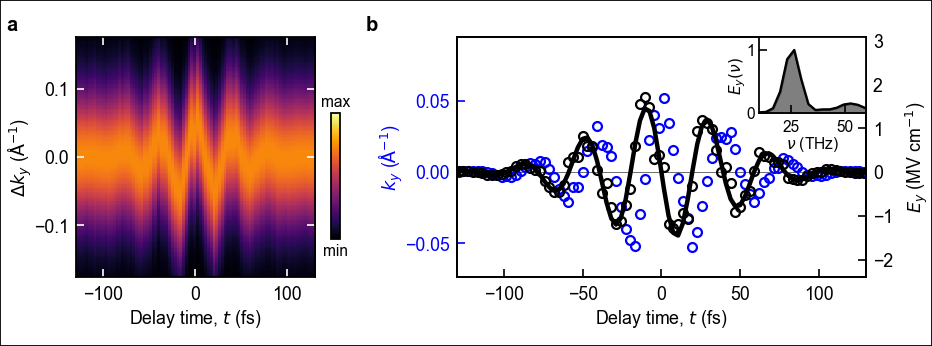

# absplot
Python wrapper for assigning absolute positions and dimensions to Matplotlib figure elements

## Motivation
Matplotlib facilitates creation of simple figures, but absolute positioning of figure elements — especially colorbars — is not straightforward. Such precise control is critical for producing complex figures for scientific
journals, and has traditionally required tools such as MATLAB or Igor Pro. This wrapper enables absolute positioning with minimal code.

## Installation
```bash
pip install git+https://github.com/suzuito125/absplot.git
```
or simply download the `absplot.py` file and
```Python
import absplot
```

## Quick Start
Firstly, define the mainframe:
```Python
mainframe = absplot.MainFrame(width=80, height=80)
```
and you can assign absolute positions and dimensions of a figure panel simply by:
```Python
pframe = absplot.PlotFrame(mainframe=mainframe, parentframe=mainframe, left=15, bottom=20, width=50, height=50)
```
The `PlotFrame` contains Matplotlib axes, and you can adjust all the other details as usual:
```Python
pframe.ax.plot(X, Y, color='black', lw=1, marker='o', ms=4, markerfacecolor='none')
pframe.ax.set_xlabel('X-Axis', fontsize=10)
pframe.ax.set_ylabel('Y-Axis', fontsize=10)
```
You can also define an empty frame as a container of multiple plot frames by:
```Python
eframe = absplot.EmptyFrame(mainframe=mainframe, left=1, bottom=1, width=160, height=80)
pframe1 = absplot.PlotFrame(mainframe=mainframe, parentframe=eframe, left=15, bottom=20, width=50, height=50)
pframe2 = absplot.PlotFrame(mainframe=mainframe, parentframe=eframe, left=15 + 80, bottom=20, width=50, height=50)
```
This function facilitates reuse of a part of a complex figure.

For a complete example including 2D images and colorbars,
see [examples/absplot_examples.ipynb](examples/absplot_examples.ipynb).



## Features
- Assignment of figure dimensions and positions in millimeters (mm)
- Precise control of colorbar dimensions and positions
- Intuitive addition of inset panels

## Use cases
- S. Ito *et al*., Nature, **616**, 696 (2023). [DOI: 10.1038/s41586-023-05850-x](https://www.nature.com/articles/s41586-023-05850-x)
